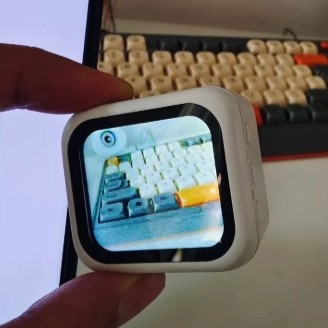
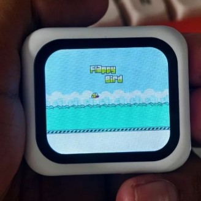

# ESP32 AI Voice Robot & Smart Display (Xiaozhi Dev Custom) 🤖

This repository contains the firmware development and custom features built on top of the **ESP32** architecture, integrated with the [Xiaozhi AI platform](https://xiaozhi.dev/). Beyond smart voice interaction, this custom build expands into an interactive smart display dashboard.

---

## 📸 Custom Features & Showcase
<table align="center">
  <tr>
    <td align="center">
       
      <b>Crypto Tracker (BTC/USD)</b>
    </td>
    <td align="center">
       
      <b>Real-time Camera Monitor</b>
    </td>
    <td align="center">
       
      <b>Retro Gaming (Flappy Bird)</b>
    </td>
  </tr>
</table>

---

## 🚀 Advanced Features
* **AI Voice Assistant:** Connected to Xiaozhi Dev platform for real-time LLM chat and TTS response.
* **Crypto Dashboard:** Live data streaming for financial analysis and asset tracking (e.g., BTC/USD chart).
* **Mini Game Station:** Supports lightweight standalone retro games like Flappy Bird.
* **Wireless Video/Image Stream:** ESP32 display rendering for live monitoring/camera feeds.

## 🛠️ Hardware Stack
* **Core Microcontroller:** ESP32 Series (optimized for SPI Display & Audio DMA)
* **Display:** High-density color display (ST7789 / ILI9341 or similar SPI LCD)
* **Audio Setup:** INMP441 I2S Microphone & MAX98357A I2S DAC Audio Amplifier

## 💻 Repository Structure
* `/src/main.cpp` - Core orchestration (WebSocket handling, audio processing, display routines).
* `/src/config.h` - Secure Wi-Fi parameters and Xiaozhi Dev API configurations.
* `/platformio.ini` - Complete compilation and dependency configuration.

---
Customized and Maintained with ❤️ by [immaculate](https://github.com/immaculaterabbit)
